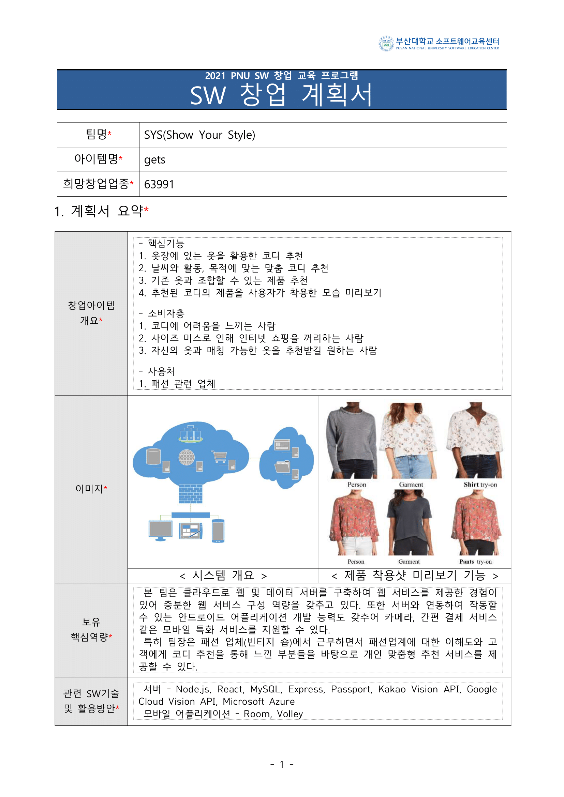
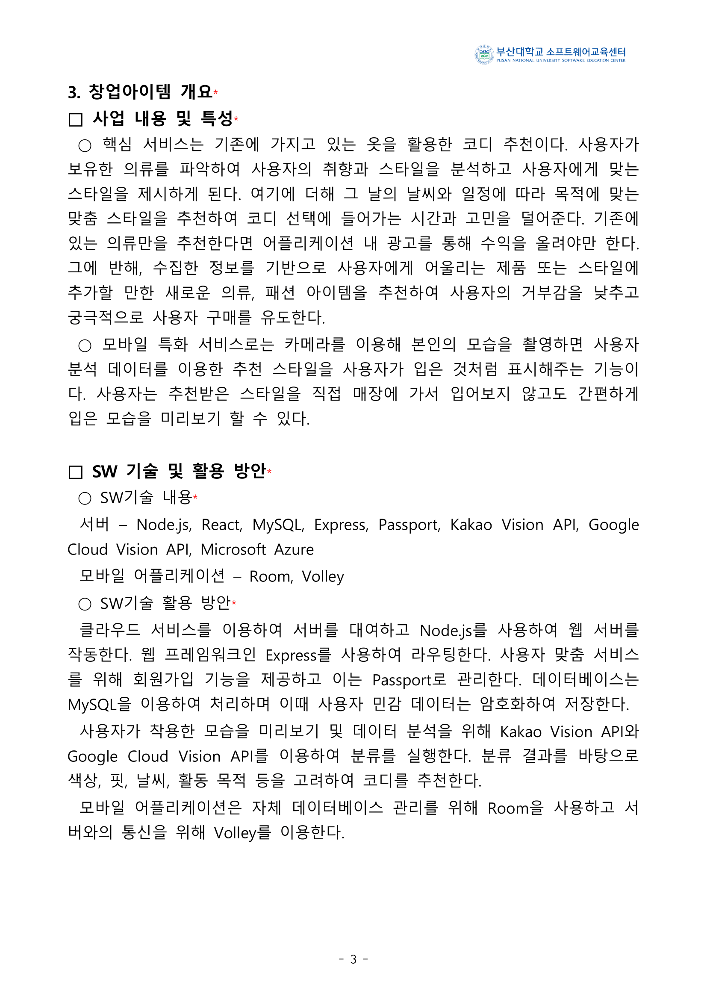
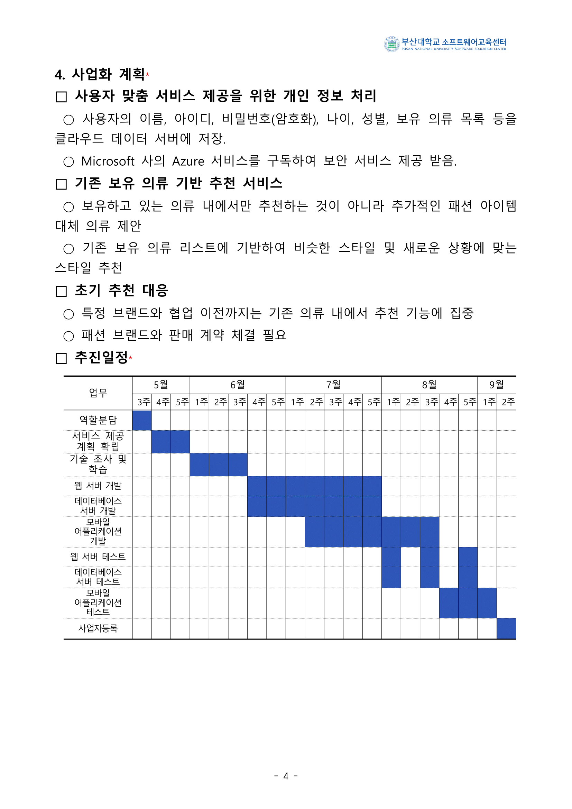
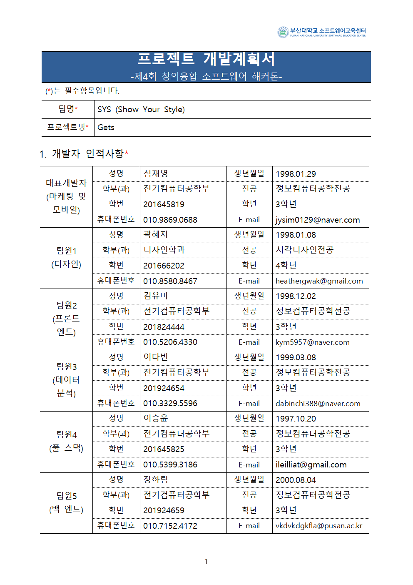
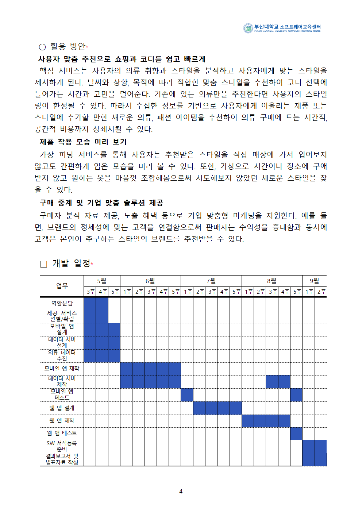
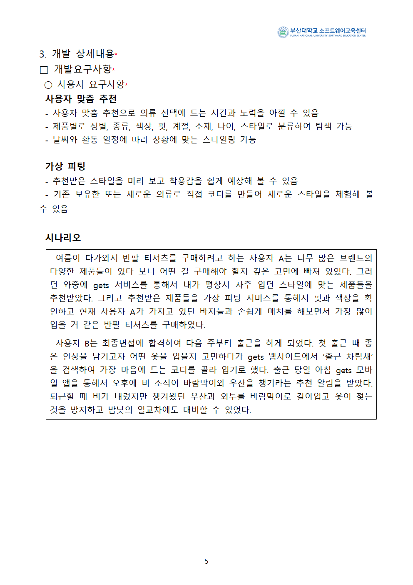
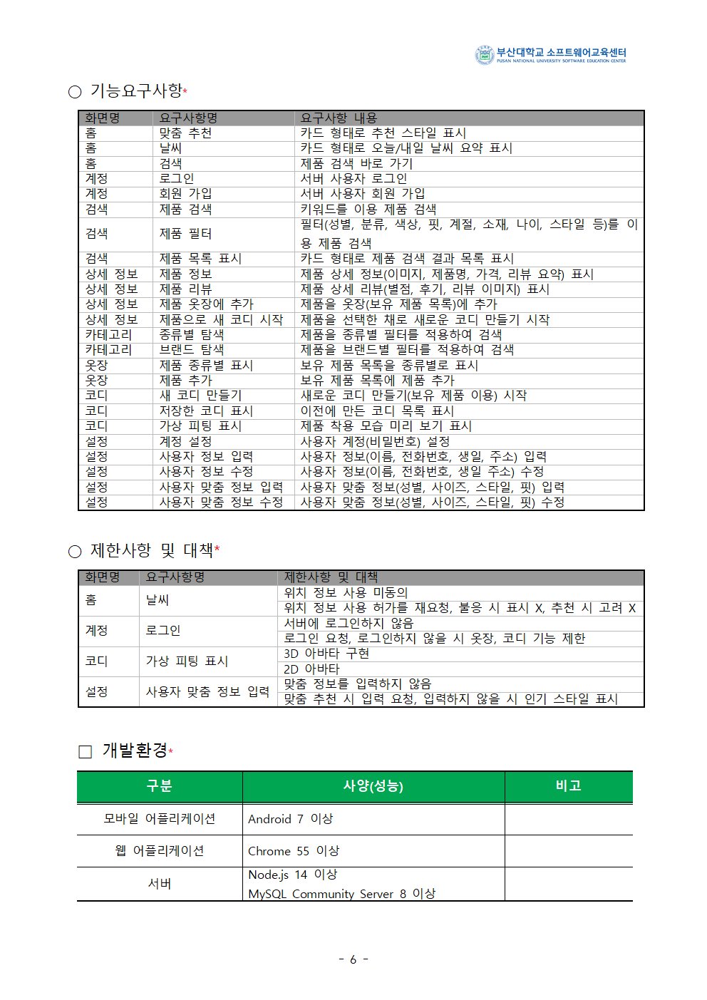

# Gets

## 프로젝트 개요

### 1. 패션 플랫폼

### 2. 구현 예정 사항

#### Android application

- 홈
    - 스타일 추천
    - 미리 보기
- 카테고리
    - 종류별 탐색
    - 상세 검색
    - 제품 정보
    - 제품 리뷰
- 옷장
    - 내 옷 종류별 표시
    - 좋아요 선택 옷 종류별 표시
- 코디
    - 사용자 정의 코디
- 설정
    - 계정 설정
    - 정보 수정
- 계정
    - 로그인
    - 회원 가입
    - 상세 정보 입력

#### Data server

- 제품
- 사용자 정보

#### Web application

- android 및 서버 개발 이후 진행

### 3. 개발 진행 사항

#### 주요 개발 일정

|항목                           |시작      |종료      |진행 |
|------------------------------|----------|----------|-----|
|제공 서비스 선별/확립            |2021/05/03|2021/05/07|완료|
|안드로이드 레이아웃 설계          |2021/05/07|2021/05/21|완료|
|의류 데이터 수집                |2021/05/14|2021/05/28|진행|
|데이터 서버 설계               |2021/05/14|2021/05/21|완료|
|데이터베이스 설계                |2021/05/14|2021/05/24|완료|
|사업계획서 작성                 |2021/05/24|2021/06/04|진행|
|안드로이드 레이아웃 제작          |-|-|예정|
|데이터 서버 제작                 |-|-|예정|
|데이터베이스 제작                 |-|-|예정|
|안드로이드 제공 서비스 제작        |-|-|예정|
|웹 레이아웃 설계                 |-|-|예정|
|웹 레이아웃 제작                 |-|-|예정|
|웹 제공 서비스 제작              |-|-|예정|
|착수 보고                        |2021/07/09|2021/07/09|예정|
|중간 보고                        |2021/08/06|2021/08/06|예정|
|최종 보고 및 창업                 |2021/09/03|2021/09/03|예정|
|포스터 제작 및 발표                |2021/09/09|2021/09/10|예정|
|최종 발표                        |2021/09/11|2021/09/11|예정|

#### 사용자 요구 사항 명세

| 화면명        | 요구사항명                | 요구사항 내용                                                                |
|-----------	|-----------------------	|--------------------------------------------------------------------------	|
| 홈            | 맞춤 추천                | 카드 형태로 추천 스타일 표시                                                |
| 홈            | 날씨                    | 카드 형태로 오늘/내일 날씨 요약 표시                                        |
| 홈            | 검색                    | 제품 검색 바로 가기                                                        |
| 계정        | 로그인                    | 서버 사용자 로그인                                                        |
| 계정        | 회원 가입                | 서버 사용자 회원 가입                                                        |
| 검색        | 제품 검색                | 키워드를 이용 제품 검색                                                    |
| 검색        | 제품 필터                | 필터(성별, 분류, 색상, 핏, 계절, 소재, 나이, 스타일 등)를 이용 제품 검색    |
| 검색        | 제품 목록 표시            | 카드 형태로 제품 검색 결과 목록 표시                                        |
| 상세 정보    | 제품 정보                | 제품 상세 정보(이미지, 제품명, 가격, 리뷰 요약) 표시                        |
| 상세 정보    | 제품 리뷰                | 제품 상세 리뷰(별점, 후기, 리뷰 이미지) 표시                                |
| 상세 정보    | 제품 옷장에 추가        | 제품을 옷장(보유 제품 목록)에 추가                                        |
| 상세 정보    | 제품으로 새 코디 시작    | 제품을 선택한 채로 새로운 코디 만들기 시작                                |
| 카테고리    | 종류별 탐색            | 제품을 종류별 필터를 적용하여 검색                                        |
| 카테고리    | 브랜드 탐색            | 제품을 브랜드별 필터를 적용하여 검색                                        |
| 옷장        | 제품 종류별 표시        | 보유 제품 목록을 종류별로 표시                                            |
| 옷장        | 제품 추가                | 보유 제품 목록에 제품 추가                                                |
| 코디        | 새 코디 만들기            | 새로운 코디 만들기(보유 제품 이용) 시작                                    |
| 코디        | 저장한 코디 표시        | 이전에 만든 코디 목록 표시                                                |
| 코디        | 가상 피팅 표시            | 제품 착용 모습 미리 보기 표시                                                |
| 설정        | 계정 설정                | 사용자 계정(비밀번호) 설정                                                |
| 설정        | 사용자 정보 입력        | 사용자 정보(이름, 전화번호, 생일, 주소) 입력                                |
| 설정        | 사용자 정보 수정        | 사용자 정보(이름, 전화번호, 생일 주소) 수정                                |
| 설정        | 사용자 맞춤 정보 입력    | 사용자 맞춤 정보(성별, 사이즈, 스타일, 핏) 입력                            |
| 설정        | 사용자 맞춤 정보 수정    | 사용자 맞춤 정보(성별, 사이즈, 스타일, 핏) 수정                            |

## 프로젝트 실행

### 1. 요구 사항

#### Android application

- Android >= 7

#### Data server

- Node.js >= 14
- MySQL Community Server >= 8

### 2. 설치 방법

#### Android application

- 요구 사항을 만족하는 emulator

#### Data server

##### 필요 프로그램 설치

- Node.js
- MySQL Community Server

##### node.js 모듈 설치

```text
npm install
```

##### 데이터베이스 설정

```mysql
create database gets;
use gets;
create table user
(
    email         VARCHAR(64) PRIMARY KEY,
    pw            VARCHAR(32)  NOT NULL,
    name          NVARCHAR(16) NOT NULL,
    phone         VARCHAR(16),
    birthday      DATE,
    address       NVARCHAR(128),
    addressDetail NVARCHAR(128),
    gender        CHAR(1),
    height        INT,
    weight        INT,
    topSize       INT,
    bottomSize    INT,
    style         INT,
    fit           INT
);

create table product
(
  id       INT PRIMARY KEY AUTO_INCREMENT,
  name     NVARCHAR(128) NOT NULL,
  brand    NVARCHAR(128) NOT NULL,
  code     NVARCHAR(64),
  gender   INT           NOT NULL,
  type     INT           NOT NULL,
  detail   INT           NOT NULL,
  color    INT           NOT NULL,
  fit      INT           NOT NULL,
  season   INT           NOT NULL,
  fiber    INT           NOT NULL,
  age      INT           NOT NULL,
  style    INT           NOT NULL,
  price    INT           NOT NULL,
  image1ID VARCHAR(32)   NOT NULL,
  image2ID VARCHAR(32) DEFAULT NULL,
  image3ID VARCHAR(32) DEFAULT NULL
);

create table review
(
    id        INT PRIMARY KEY AUTO_INCREMENT,
    userEmail VARCHAR(64),
    productID INT           NOT NULL,
    star      INT           NOT NULL,
    contents  VARCHAR(2048) NOT NULL,
    date      DATE          NOT NULL DEFAULT (current_date),
    image1ID  INT           NOT NULL,
    image2ID  INT                    DEFAULT NULL,
    image3ID  INT                    DEFAULT NULL,
    FOREIGN KEY (userEmail) REFERENCES user (email) ON UPDATE CASCADE ON DELETE SET NULL,
    FOREIGN KEY (productID) REFERENCES product (id) ON UPDATE CASCADE ON DELETE CASCADE
);
```

##### 서버 실행

server 파일에서

```text
node ./bin/www
```

##### 서버 접속

메인페이지:
[http://localhost:3000](http://localhost:3000)  
API:
[http://localhost:3000/api](http://localhost:3000/api)

## 계획안

### 창업






### 해커톤






