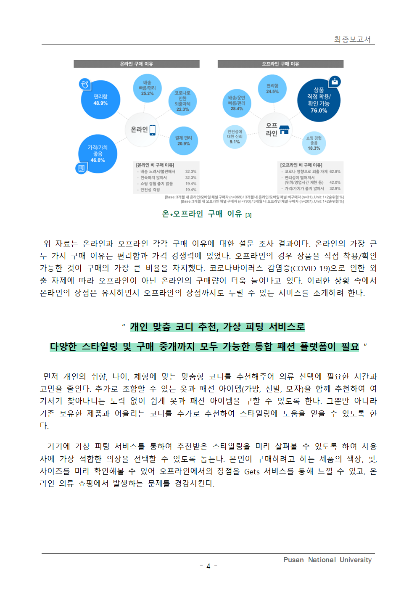
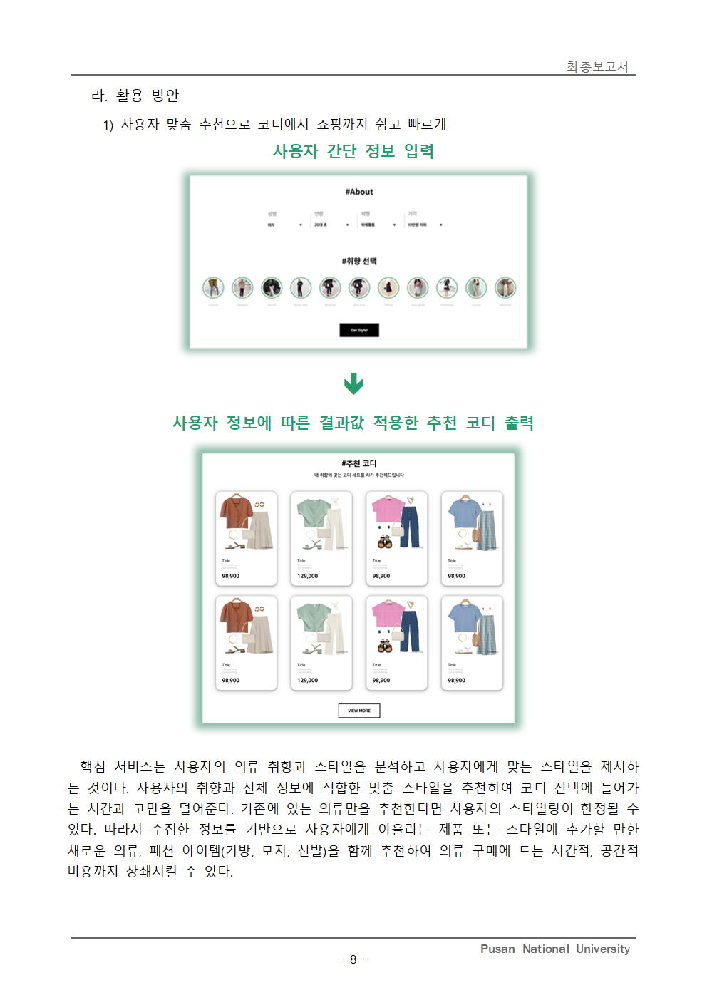
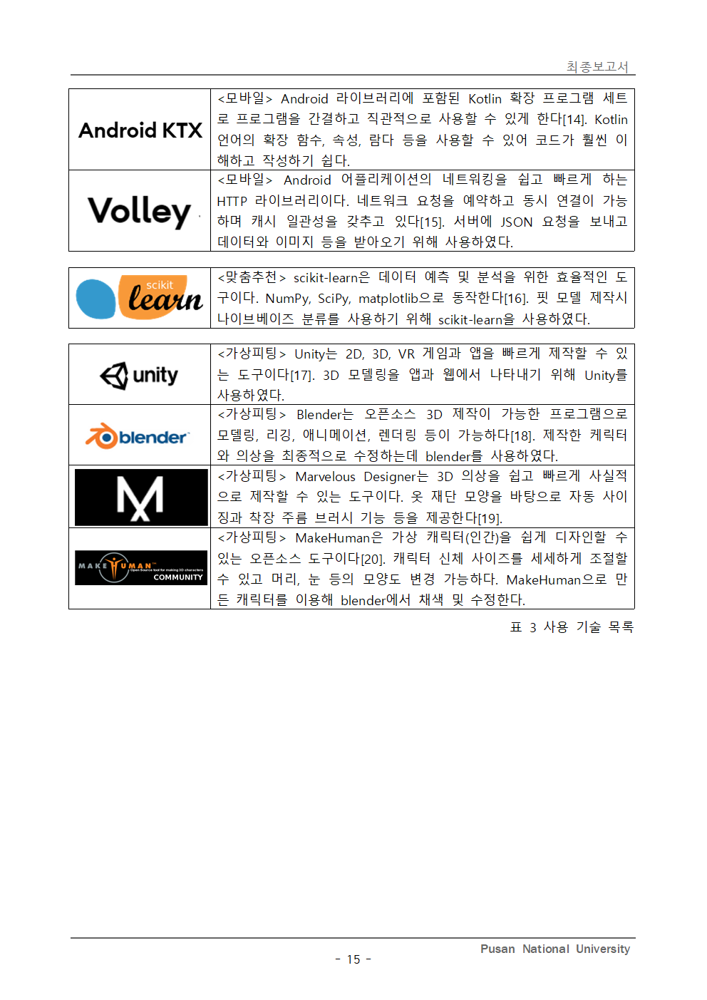
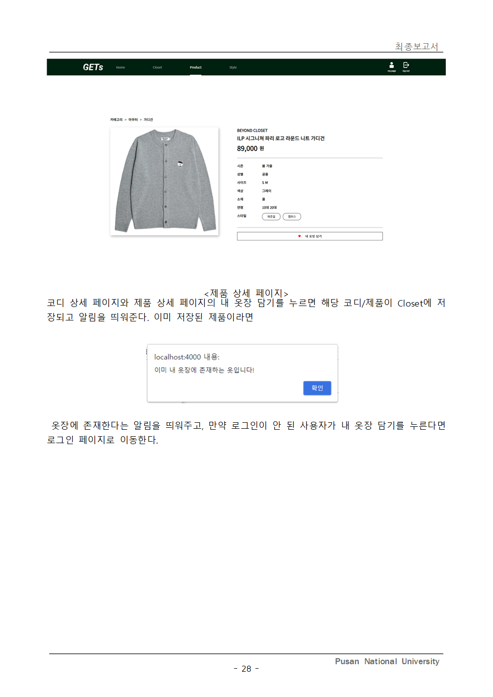
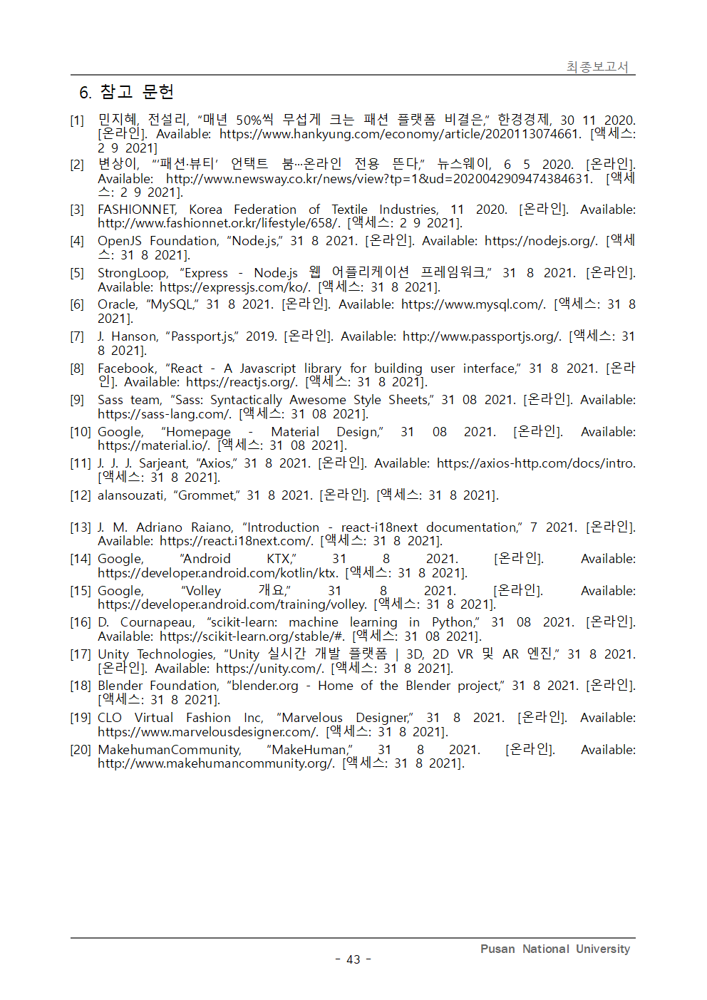

# GETs

## 프로젝트 개요

### 1. GETs

- 개인 맞춤형 패션 플랫폼
- Guess Style, Get Style

맞춤 추천과 가상 피팅 기능 중점, 사용자 맞춤형 기능 제공


[시연 영상](./image/final/시연영상.mp4)

### 2. 주요 기능

- 맞춤 추천
- 가상 피팅

#### 페이지 구조

- 홈
    - 맞춤 추천
    - 스타일 가이드
    - 탑 트렌드
- 제품
    - 종류별(카테고리) 탐색
    - 제품 상세 정보
- 옷장
    - 제품 목록 (좋아요 선택한 항목)
    - 코디 목록 (좋아요 선택한 항목)
    - 코디 상세 정보
    - 가상 피팅
- 계정
    - 로그인/로그아웃
    - 회원 가입
    - 상세 정보 입력(수정)

### 3. 개발 일정

#### 주요 개발 일정

| 항목              | 기간                      | 상태  |
|-----------------|-------------------------|-----|
| 제공 서비스 선별/확립    | 2021/05/03 – 2021/05/07 | 완료  |
| 역할 분담 및 개발환경 구축 | 2021/05/03 – 2021/05/07 | 완료  |
| 모바일 설계          | 2021/05/07 – 2021/05/21 | 완료  |
| 서버 설계           | 2021/05/14 – 2021/06/25 | 완료  |
| 웹 설계            | 2021/05/14 – 2021/06/25 | 완료  |
| 의류 데이터 수집       | 2021/05/17 – 2021/06/04 | 완료  |
| 모바일 제작          | 2021/06/21 – 2021/08/29 | 완료  |
| 서버 제작           | 2021/06/21 – 2021/08/29 | 완료  |
| 웹 제작            | 2021/06/28 – 2021/08/29 | 완료  |
| 착수 보고           | 2021/07/09              | 완료  |
| 맞춤 추천 알고리즘 제작   | 2021/07/12 – 2021/08/27 | 완료  |
| 가상 피팅 제작        | 2021/07/25 – 2021/09/02 | 완료  |
| 중간 보고           | 2021/08/06              | 완료  |
| 최종 테스트          | 2021/08/29 – 2021/09/03 | 완료  |
| SW 저작등록 준비      | 2021/08/29 – 2021/09/03 | 완료  |
| 결과보고서 및 발표자료 작성 | 2021/08/29 – 2021/09/03 | 완료  |

## 프로젝트 실행

### 1. 요구 사항

#### Android application

- Android >= 7

#### Data server

- Node.js >= 14
- MySQL Community Server >= 8

#### Web server

- Node.js >= 14

### 2. 설치 방법

#### Android application

- emulator 또는 휴대 전화에서 실행

#### Data server

##### 필요 프로그램 설치

- Node.js
- MySQL Community Server

##### node.js 모듈 설치

- server 파일과 web 파일에서 각각

```text
npm install
```

#### python 모듈 설치

```text
pip install joblib
pip install numpy
pip install sklearn.utils
```

##### 데이터베이스 설정

- 수동 설정

```mysql
create database gets;
create database session;
use gets;

create table user
(
    email         VARCHAR(64) PRIMARY KEY,
    pw            VARCHAR(64)  NOT NULL,
    name          NVARCHAR(16) NOT NULL,
    phone         VARCHAR(16),
    birthday      DATE,
    address       NVARCHAR(128),
    addressDetail NVARCHAR(128),
    gender        INT,
    height        INT,
    weight        INT,
    topSize       INT,
    bottomSize    INT,
    shoulder      INT,
    waist         INT,
    hip           INT,
    thigh         INT,
    style         INT
);

create table product
(
    id       INT PRIMARY KEY AUTO_INCREMENT,
    name     NVARCHAR(128) NOT NULL,
    brand    NVARCHAR(128) NOT NULL,
    code     NVARCHAR(64),
    gender   INT           NOT NULL,
    type     INT           NOT NULL,
    detail   INT           NOT NULL,
    color    INT           NOT NULL,
    fit      INT           NOT NULL,
    season   INT           NOT NULL,
    fiber    INT           NOT NULL,
    age      INT           NOT NULL,
    style    INT           NOT NULL,
    price    INT           NOT NULL,
    size     VARCHAR(128)  NOT NULL,
    image1ID VARCHAR(32)   NOT NULL,
    image2ID VARCHAR(32) DEFAULT NULL,
    image3ID VARCHAR(32) DEFAULT NULL
);

create table coordination
(
    id            INT PRIMARY KEY AUTO_INCREMENT,
    title         VARCHAR(64),
    outerID       INT,
    outerImageID  INT,
    topID         INT,
    topImageID    INT,
    top2ID        INT,
    top2ImageID   Int,
    bottomID      INT,
    bottomImageID INT,
    skirtID       INT,
    skirtImageID  INT,
    setID         INT,
    setImageID    INT,
    shoesID       INT,
    shoesImageID  INT,
    bagID         INT,
    bagImageID    INT,
    hatID         INT,
    hatImageID    INT,
    style         INT,
    gender        INT,
    age           INT,
    season        INT,
    fit           INT,
    price         INT,
    imageID       VARCHAR(64)
);

create table favoriteProduct
(
    userEmail VARCHAR(64),
    productID INT,
    PRIMARY KEY (userEmail, productID),
    FOREIGN KEY (userEmail) REFERENCES user (email) ON UPDATE CASCADE ON DELETE CASCADE,
    FOREIGN KEY (productID) REFERENCES product (id) ON UPDATE CASCADE ON DELETE CASCADE
);

create table favoriteCoordination
(
    userEmail      VARCHAR(64),
    coordinationID INT,
    PRIMARY KEY (userEmail, coordinationID),
    FOREIGN KEY (userEmail) REFERENCES user (email) ON UPDATE CASCADE ON DELETE CASCADE,
    FOREIGN KEY (coordinationID) REFERENCES coordination (id) ON UPDATE CASCADE ON DELETE CASCADE
);

create table article
(
    id             INT PRIMARY KEY AUTO_INCREMENT,
    name           NVARCHAR(128)  NOT NULL,
    tag            NVARCHAR(128)  NOT NULL,
    tag_en         NVARCHAR(128)  NOT NULL,
    description    NVARCHAR(1024) NOT NULL,
    description_en NVARCHAR(1024) NOT NULL
);

create table articleImage
(
    articleID INT,
    imageID   INT,
    PRIMARY KEY (articleID, imageID)
);
```

- 자동 설정  
  아래 사이트로 접속

```text
/input/ready
/input/product
/input/coordination
/input/article
```

##### 서버 실행

- server 파일에서

```text
node ./bin/www
```

- web 파일에서

```text
node start
```

##### 서버 접속

메인페이지:
[http://localhost:4000](http://localhost:4000)  
API:
[http://localhost:3000/api](http://localhost:3000/api)

## 최종 보고서
















